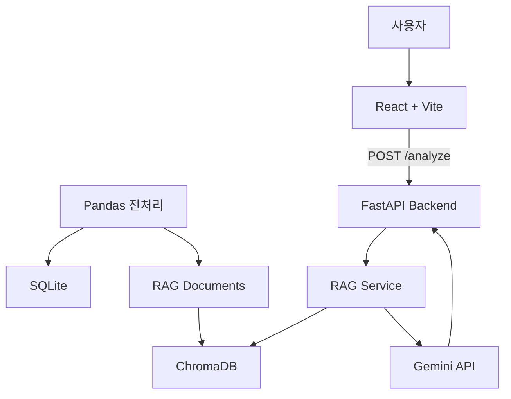
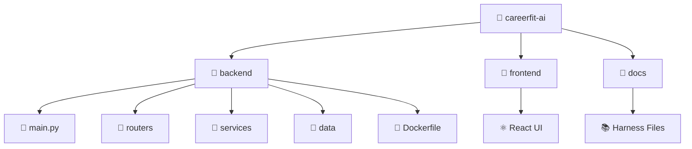

# CareerFit AI

> 취업·공모전 데이터 기반 맞춤형 AI 포트폴리오 코치

## 📌 프로젝트 개요
- 현황 및 문제점: 취업 준비생이 수많은 채용 공고와 공모전을 수동으로 탐색하고, 자신의 기술 스택과 희망 직무 간의 적합성을 객관적으로 파악하는 데 불필요한 시간이 소요됨.
- 해결 과제: 직무 역량의 객관적 분석과 보완점 도출을 자동화할 수 있는 데이터 기반의 추천 시스템 필요.
- 해결 방법
    1. RAG 기반 검색 파이프라인: 사용자 입력(전공, 보유 기술, 희망 직무)을 바탕으로 벡터 DB(ChromaDB)에서 관련성이 높은 취업 공고를 RAG 방식으로 추출.
    2. Gemini 역량 분석: 검색된 공고 데이터를 컨텍스트로 활용하여, Gemini가 현재 역량을 분석하고 스킬 갭(Skill gap)을 채울 수 있는 프로젝트를 생성 및 추천.
    3. 결과 신뢰성 확보: 분석 결과와 함께 Reference(참고한 원본 공고 Sources)를 명시하여 AI 답변의 근거를 제공하고 신뢰도를 향상.

## 🛠 기술 스택
| 영역 | 기술 |
|---|---|
| 백엔드 | Python 3.11, FastAPI |
| AI API | Gemini 2.5 Flash-Lite |
| 데이터 | Pandas, SQLite, ChromaDB |
| 프론트엔드 | React, Vite |
| 실행 환경 | Docker |

## 🏗 아키텍처


## 🚀 실행 방법

### Docker로 실행 (권장)
```bash
# 1. 이미지 빌드
docker build -t careerfit-ai ./backend

# 2. 컨테이너 실행
docker run -p 8000:8000 --env-file backend/.env careerfit-ai
```
API 문서: http://localhost:8000/docs

### 로컬 실행
```bash
cd backend

python -m venv venv

source venv/bin/activate # Windows: venv\Scripts\activate

pip install -r requirements.txt

uvicorn main:app --reload --port 8000
```

## 📊 데이터 파이프라인
```
CSV → Pandas 전처리 → SQLite (구조화 저장) → ChromaDB (벡터 검색)
```

전처리 실행:
```bash
python data/preprocess.py
```

## ✨ 주요 기능
- RAG 기반 역량 분석: 취업 공고 데이터를 근거로 맞춤형 조언 제공
- 출처 표시: 어떤 공고 데이터를 참고했는지 sources로 함께 반환
- Mock Mode: API 한도 초과 시 MOCK_MODE=true 로 폴백 가능

## 📁 프로젝트 구조


## 🔮 향후 개선
- [ ] 이력서 PDF 업로드 후 자동 역량 추출
- [ ] 공모전 마감일 캘린더 연동 기능
- [ ] RAG 검색 품질 평가 지표 추가 (Ragas 등)

## 📝 개발 과정
- RAG와 ChromaDB의 동작 원리 이해
    RAG는 단순히 Gemini를 호출하는 것이 아니라 ChromaDB에서 관련 문서를 검색해 근거와 함께 전달하는 구조입니다. sources와 collection.count(), 검색 결과를 함께 확인하면서 데이터 검색 → 프롬프트 → 응답의 흐름을 단계별로 점검하는 것이 가장 효과적인 해결책입니다.
- FastAPI·환경설정 및 실행 오류 해결
    venv, .env, API Key, CORS, 실행 위치 등 환경 설정이 연결되어 있어 작은 설정 하나만 달라도 오류가 발생하기 쉽습니다. 오류가 생기면 실행 명령어 → 오류 메시지 → (venv) 활성화 → .env 및 서버 상태 순서로 확인하면 대부분의 문제를 빠르게 찾을 수 있습니다.

---
## Demo
- Live Demo: https://careerfit-ai-m5x7.onrender.com

---
## Developer
- Name: WhiJoo Kim
- Role: Backend / AI Service Development
- GitHub: @whistleK11
- Email: wtiger1108@gmail.com


